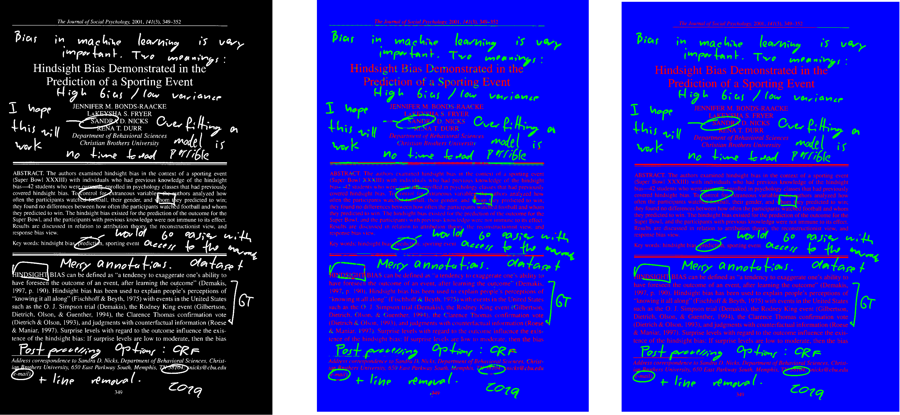

# printed-hw-segmentation
### _Lightweight printed and handwritten text identification using FCN and CRF post-processing._

[]( https://g.codefresh.io/pipelines/BuildTestPush/builds?repoOwner=Jumpst3r&repoName=printed-hw-segmentation&serviceName=Jumpst3r%2Fprinted-hw-segmentation&filter=trigger:build~Build;branch:production;pipeline:5caa428088545f2b9e9e45e9~BuildTestPush) [](https://opensource.org/licenses/MIT) 

### _published as:_ PHTI-WS: A Printed and Handwritten Text Identification Web Service Based on FCN and CRF Post-Processing* in  _ICDAR-WS 2019_

## Introduction

**printed-hw-segmentation** is a tool that allows segmentation (identification) of printed and handwritten text using a fully convolutional network with CRF post-processing.

If you make use of this work (the corresponding paper can be found [here](https://ieeexplore.ieee.org/document/8892961)), please cite it as:
```
@article{Dutly2019PHTIWSAP,
  title={PHTI-WS: A Printed and Handwritten Text Identification Web Service Based on FCN and CRF Post-Processing},
  author={Nicolas Dutly and Fouad Slimane and Rolf Ingold},
  journal={2019 International Conference on Document Analysis and Recognition Workshops (ICDARW)},
  year={2019},
  volume={2},
  pages={20-25}
}
```

 

_left: input image, middle: raw FCN output, right: output after CRF postprocessing_

With each release a docker image of the code is published on [docker hub](https://cloud.docker.com/repository/docker/jumpst3r/printed-hw-segmentation). This image can be used in conjuction with [DIVA services](https://github.com/lunactic/DIVAServices) to provide segmenation as a web service. It can also be used locally.

## Web service live demo

The web service version of this project can be tested at the following [link](http://wuersch.pillo-srv.ch/#/algorithm/5ff5b809fad531d7dc0f29c4)

## Local Usage

After pulling (`docker pull jumpst3r/printed-hw-segmentation:latest`) the image, the model can be applied to an image with 

`docker run -it --rm -v /FULL_PATH_TO/example.png:/input/example.png -v /FULL_PATH_TO_OUTPUT_FOLDER/:/output/ jumpst3r/printed-hw-segmentation sh /input/script.sh /input/example.png /output/`

The resulting image will be saved in the output path provided by the user

## Usage using the DIVA services framework

Follow the guide [here](https://lunactic.github.io/DIVAServicesweb/articles/installation/) to install the DIVA services framework on a server.

Once install, our method can be installed by make a POST request to the `alogithms` endpoint. This request should contain the JSON file `install.json` located in the `diva-service` folder of this repository. This will return a link pointing to the newly created method. The JSON file `upload.json` can then be run to upload an image to the server by making a request to that link. This will return an ID for the uploaded image. Finally the method can be executed using the provided ID and the JSON file `run.json` 

### Local Testing and development

If you wish to modify or try to execute individual files, create a conda new conda environment with the file `environment.yml`. After activating the newly created environment, you should be able to run and modify existing files without dependency problems.

A few important files are listed bellow.

The ```FCN/``` folder contains all files which are relevant to the training and testing of the two FCN models _fcn-light1_ and _fcn-light-2_.

Specifically, the models are defined in the files ``fcn-light-1.py`` and ``fcn-light-2.py``.

If you want to test the performance and get IoU result metrics, you will need access to the ``test/`` folder of the ``printed-hw-seg`` dataset (upon request).

To classify single images you can use the script ``classifier_fcnn.py``, which offers a bunch of options. The release binary is a standalone version of this file.

The ``fontend/`` folder contains a discontinued frontend for interations with the DIVA service framework.

The ``docker/`` folder contains docker-specific files which are used to generate the docker image of the tool.

The ``diva-service/`` folder contains example JSON file which can be used to deploy the method on a server
running DIVA services.

_disclaimer:_ The quality of the predictions depends on many factors such as input resolutions, format, colors etc. We do not claim that the models present in this repository perform universally well on all documents. The models were train, validated and tested on a private dataset.

_For word level segmentation, have a look at the ``practical-word-level`` branch._
